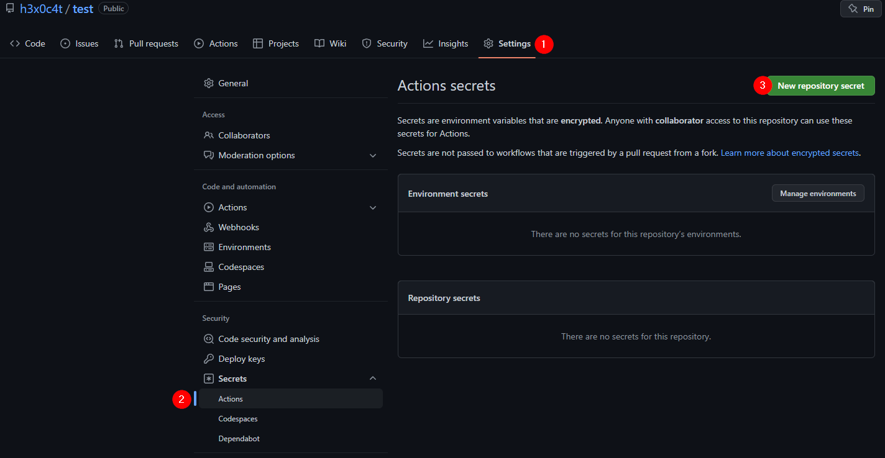

**Это продолжение** [**предыдущей статьи**](https://hexocat.com/p/hugo-github-actions/).

## Зачем?

Я просто ненавижу тратить время на возню с картинками, организацией папок и т.д.\
Поэтому я решил упростить все это дело, чтобы можно было просто создать папку с единственным файлом и писать, а добавление картинок и т.д. происходило автоматически.

После долгих поисков markdown редакторов я решил остановиться на [visual studio code](https://code.visualstudio.com/).\
В нем есть встроенная поддержка markdown и git, а также плагин для вставки картинок и сохранения их в нужную папку.

## План

  

## Организация папок

Создаем папку, отделенную от папки с проектом, в которой мы будем редактировать посты.\
В ней будет еще 2 папки - одна для опубликованных постов, а вторая для черновиков.


## Установка плагинов для VS Code

Для автоматического сохранения картинок в папку при их вставке из буфера устанавливаем плагин [Markdown Image](https://marketplace.visualstudio.com/items?itemName=hancel.markdown-image).\
Теперь при нажатии `Alt + Shift + V` картинка будет сохранена в папку `images` и вставлена в текст.

Проверьте что у вас такие настройки плагина:

- Более короткое название файла\
  
- Сохраняем картинку на диск\

- Имя папки с картинками\
  

Теперь при вставке картинки в текст она будет сохранена в папку `images` и вставлена в текст.

У меня так же стоит плагин [Markdown All in One](https://marketplace.visualstudio.com/items?itemName=yzhang.markdown-all-in-one), который добавляет несколько горячих клавиш.\
А для автоматического форматирования [markdownlint](https://marketplace.visualstudio.com/items?itemName=DavidAnson.vscode-markdownlint).

## Автоматическая публикация

> Все дальнейшие действия напрямую связаны с предыдущим [постом](https://hexocat.com/p/hugo-github-actions/), поэтому если вы его не читали, то сначала прочитайте его.

Смысл в том, что мы пишем посты в папке с черновиками (в моем случае `in-process`), а при переносе в папку с опубликованными постами (в моем случае `published`) происходит автоматическая публикация.

Создаем файл `.gitingore` в корне и добавляем в него папку с черновиками:

```txt
in-process/
```

Создаем workflow `.github/workflows/UpdatePosts.yml`:

```yml
name: UpdatePosts

on:
  push:
    branches:
      - main

jobs:
  deploy:
    name: Deploy
    runs-on: ubuntu-22.04
    steps:
      - uses: actions/checkout@v3

      - name: Push to repo
        uses: s0/git-publish-subdir-action@v2.6.0
        env:
          REPO: <SSH-адрес репозитория из предыдущего поста>
          BRANCH: main
          FOLDER: published # имя папки с опубликованными постами
          SSH_PRIVATE_KEY: ${{ secrets.DEPLOY_PRIVATE_KEY }}
          TARGET_DIR: content/post
```

Далее необходимо создать ssh-ключ для автоматической публикации:

```bash
ssh-keygen -t rsa -b 4096 -C "your_email@example.com"
```

Теперь создаем пустой репозиторий на github и добавляем сгенерированный приватный ключ в секреты репозитория с именем `DEPLOY_PRIVATE_KEY`:



В репозитории с блогом добавляем сгенерированный публичный ключ в `Deploy keys`:


## Создание и публикация нового поста

Создадим новый пост в папке с черновиками. Структура папки выглядит следующим образом:

  

- В корне находится файл `template.md`, который содержит шаблон `front matter`.

- Папка называется так же, как и тэг `slug` в `front matter` (так будет отображаться путь в URL). Внутри папки находится файл `index.md`, который содержит текст поста.\
  

- Картинки автоматически сохраняются в папку `images`.

После написания поста просто перетаскиваем его в папку `published`.

> Для дальнейшей работы у вас должны быть настроены ssh-ключи доступа ([гайд](https://docs.github.com/en/authentication/connecting-to-github-with-ssh/adding-a-new-ssh-key-to-your-github-account)).

Инициализируем репозиторий и пушим:

```bash
git init
git add .
git commit -m "first commit"
git branch -M main
git remote add origin <ssh-адрес репозитория>
git push -u origin main
```

После этого, если все сделано правильно, папка `published` должна появиться в репозитории с опубликованными постами.\
Затем workflow запустится автоматически и запушит изменения в репозиторий с блогом в папку `content/post`.\
После этого можно проверить, что пост опубликовался (если настроен workflow для автоматической публикации из предыдущего поста).

## Результат в гифке

Теперь весь процесс публикации выглядит так:\
