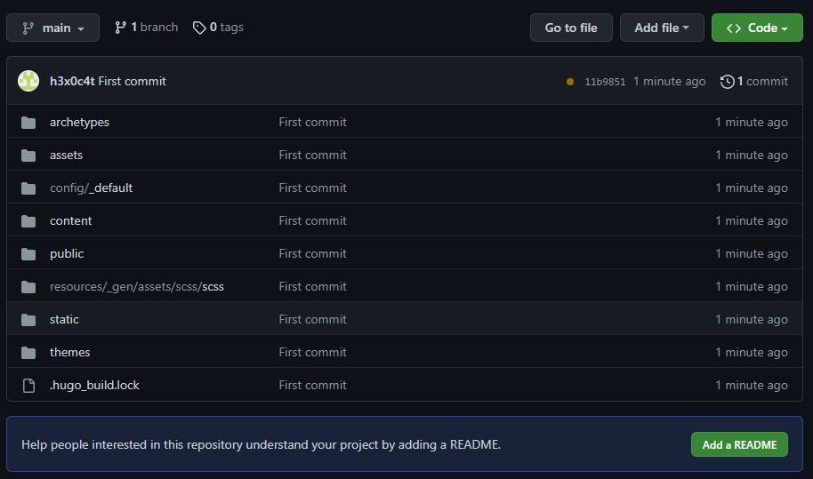
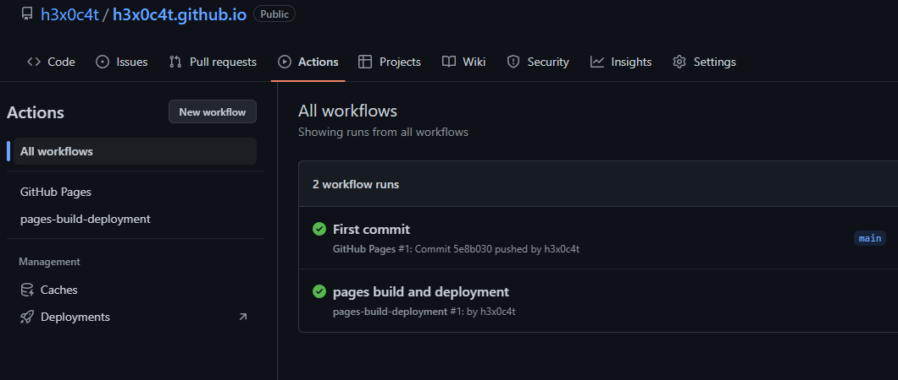
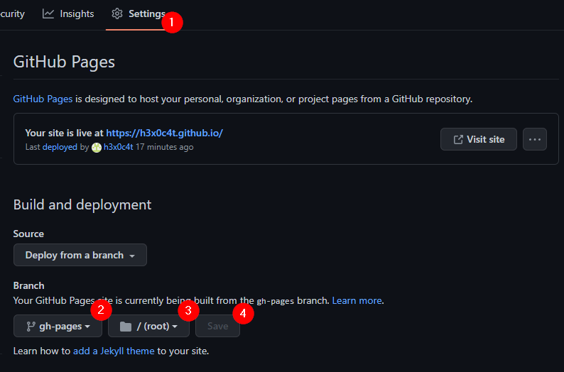
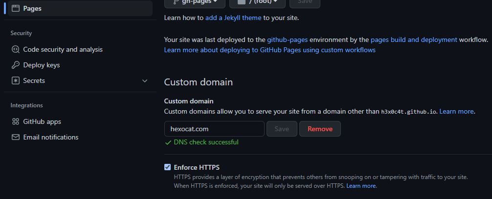

## До автоматизации

Создаем новый проект: `hugo new <название>`

На GitHub создаем репозиторий с названием `<username>.github.io`

> Для того, чтобы дальше все проходило без ошибок, убедитесь что у настроены SSH ключи на GitHub. Как это сделать описано [здесь](https://google.com)

Далее в папке с проектом выполняем команды:

```bash
git init
git add .
git commit -m "First commit"
git branch -M main
git remote add origin <SSH ссылка на ваш репозиторий>
git push -u origin main
```

После этого в вашем репозитории должен появиться проект.

  

## Автоматизация

Для автоматизации создадим файл `.github/workflows/gh-pages.yml` с содержимым:

```yaml
name: GitHub Pages

on:
  push:
    branches:
      - main # Ветка, при пуше в которую будет запускаться деплой
  pull_request:

jobs:
  deploy:
    runs-on: ubuntu-22.04
    permissions:
      contents: write
    concurrency:
      group: ${{ github.workflow }}-${{ github.ref }}
    steps:
      - uses: actions/checkout@v3
        with:
          submodules: true
          fetch-depth: 0

      - name: Setup Hugo
        uses: peaceiris/actions-hugo@v2
        with:
          hugo-version: "0.109.0" # Версия Hugo
          extended: true # Если вам нужна extended версия Hugo

      - name: Build
        run: hugo --minify

      - name: Deploy
        uses: peaceiris/actions-gh-pages@v3
        # Если вы используете другую ветку, то измените
        # `main` на вашу ветку в `refs/heads/main` ниже.
        if: ${{ github.ref == 'refs/heads/main' }}
        with:
          github_token: ${{ secrets.GITHUB_TOKEN }}
          publish_dir: ./public
```

Теперь, при каждом коммите в ветку `main` будет запускаться автоматизация, которая соберет проект и запушит его в ветку `gh-pages`.

Запушим новый файл в репозиторий:

```bash
git add .
git commit -m "Add GitHub Actions"
git push
```

После этого, в разделе `Actions` должен появиться новый воркфлоу, а в ветке `gh-pages` должен появиться собранный проект.

  

Теперь, нужно перейти в настройки репозитория и в разделе `Pages` выбрать ветку `gh-pages` и папку `/ (root)`.

  

После сохранения с айт будет доступен по адресу `<username>.github.io`.

## Дополнительно

### Добавление своего домена

Для того, чтобы добавить свой домен, нужно создать файл `CNAME` в папке `static` с содержимым:

```txt
<your-domain>
```

Пушим изменения в репозиторий:

```bash
git add .
git commit -m "Add CNAME"
git push
```

Затем, нужно добавить следующие A записи в DNS:

```txt
185.199.108.153
185.199.109.153
185.199.110.153
185.199.111.153
```

Также, нужно добавить следующие CNAME записи в DNS:

```txt
<username>.github.io
```

Через некоторое время, сайт будет доступен по вашему домену.

Чтобы принудительного включения HTTPS, ставим галочку `Enforce HTTPS` в настройках репозитория.

  

### Добавление сабдомена

Если же вы хотите чтобы сайт был доступен по сабдомену, то также нужно создаем файл `CNAME` в папке `static` с содержимым:

```txt
<subdomain>.<your-domain>
```

Пушим изменения в репозиторий:

```bash
git add .
git commit -m "Add CNAME"
git push
```

Затем, в панели управления доменом добавляем CNAME запись в DNS:

```txt
<username>.github.io
```

Через некоторое время, сайт будет доступен по сабдомену.
